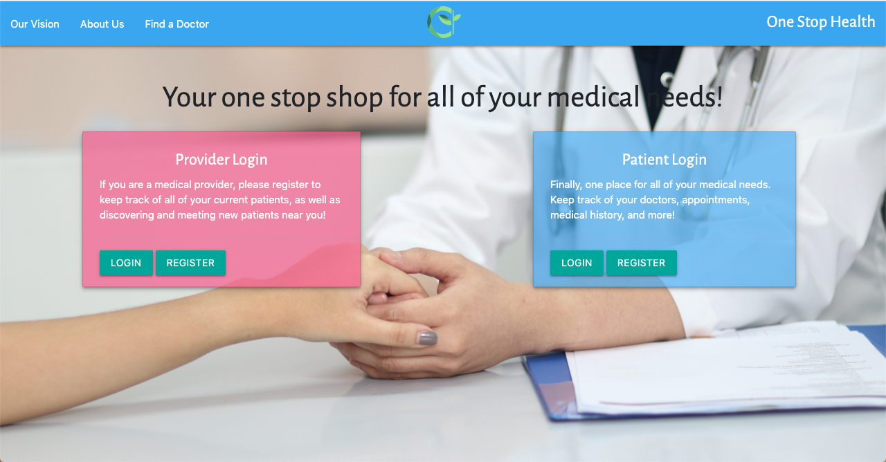

## Welcome to One Stop Health!

 

# <a name="introduction"> Introduction </a>
One Stop Health is designed to: 

1. Provide a large database of providers for patients to choose from, depending on their health needs and insurance status.

2. Easy, convenient management for providers. Providers can easily access their current patients, and also given the ability to either accept or decline new patient requests.

# <a name="vision"> Our Vision </a>

From the patient side, we discovered that patients often struggle with finding the right doctor for their specific conditions, and when they do, they have to put themselves through the process of filing out personal information all over again. One Stop Health takes in the patient's contact information upon registration so that when the patient is logged in, all he/she has to do is input a medical issue, and a response will be sent from Better Doctors API with related doctor information.

From the provider side, One Stop Health is a platform that will allow easier management of current patients, along with the ability to approve or decline pending patient requests. 

---

# Table of Contents

- [Introduction](#introduction)
- [Our Vision](#vision)
- [Technologies Used](#technology) 
* [MySQL](#tech) 
* [Handlebars](#tech) 
* [Google Fonts](#tech) 
* [Materialize.css](#materialize) 
* [BetterDoctor API](#betterdocs)
* [Okta Authentication](#okta) 
- [Meet the Authors](#authors)

---

# <a name="technology"> Technologies Used In This Project </a>

#### <a name="tech"> Express Handlebars, MySQL, Google Fonts </a>

Upon landing on our main page, the user will be given two modals to choose from, and either login or register for a new account.

 

<!-- Screenshot/GIF here -->
Once the user's credentials are verified, he/she will be sent to the appropriate dashboard.
<!-- Patient dashboard + search -->
 
<!-- Provider dashboard here -->

#### <a name="materialize"> Materialize Design </a>

Materialize is a front-end framework that we designed and styled our page with.

Visit their website for more documentation on Materialize CSS: https://materializecss.com/

#### <a name="betterdocs"> BetterDoctor API </a>

The BetterDoctor API allows access to the most comprehensive and consistently updated physician and practice data available. In this case, BetterDoctor API returns a list of doctors to the user based on the zip code given at registration, along with the input medical condition.

More documentation on the BetterDoctor API can be found at: https://developer.betterdoctor.com

#### <a name="okta"> Okta Identity Cloud </a>

Okta is a cloud software provider that manages and secures user authentication. In this case, we used Okta for the user login authentication.

For more information on Okta, please feel free to visit: https://www.okta.com

# <a name="deployed"> Deployed Site </a>
Visit our deployed project at: https:/onemedhealth.herokuapp.com/

# <a name="authors">Meet the Authors!</a>

|     Author           |  Summary|    Fun Fact         | Hobbies    |
|----------------------|---------|---------------------|------------|
<b>Kanwar Batra  https://github.com/kanwarb       |Kanwar has an extensive background working with computers, working as a Cloud Architect for the past 8 years and as an architect for over 15 years. |Kanwar has built large distributed systems for many reputible organizations in and around the San Francisco Bay Area  | Golfing and working out
|<b>Calvin Chau  https://bavarianstance.github.io/CC-Bootstrap-Portfolio/           |Calvin possesses a background in business management and sales, specializing in the Big Data and Analytics space. Backend technologies that interest him in particular include: data infrastructure, cybersecurity and wireless technologies.|Built a mining farm for cryptocurrency; also has an Instagram account with 19.1k followers (ALL ORGANIC!) |Modding car non-stop |
|<b>Samuel Thompson    https://github.com/peepcrusher     |Sam has a degree in Recreation, Parks & Tourism. Sam decided to get into tech because he has always felt comfortable working with computers and would like to take the next step towards a career in technology.|Sam can peel an orange all in one piece. |Dancing
|<b>Andrew Xie    https://github.com/xieandrew2235     |Andrew is a recent college graduate with a degree in International Politics. He hopes that this bootcamp will be the first step towards a career in web development.    |Andrew graduated from college in China. | Watching sports :baseball:
